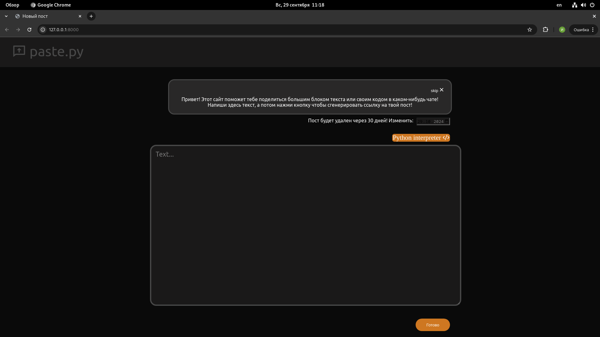
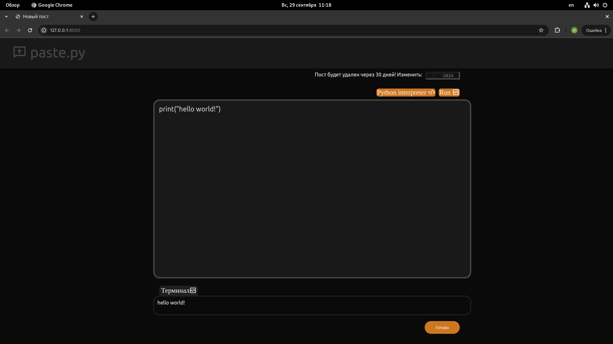
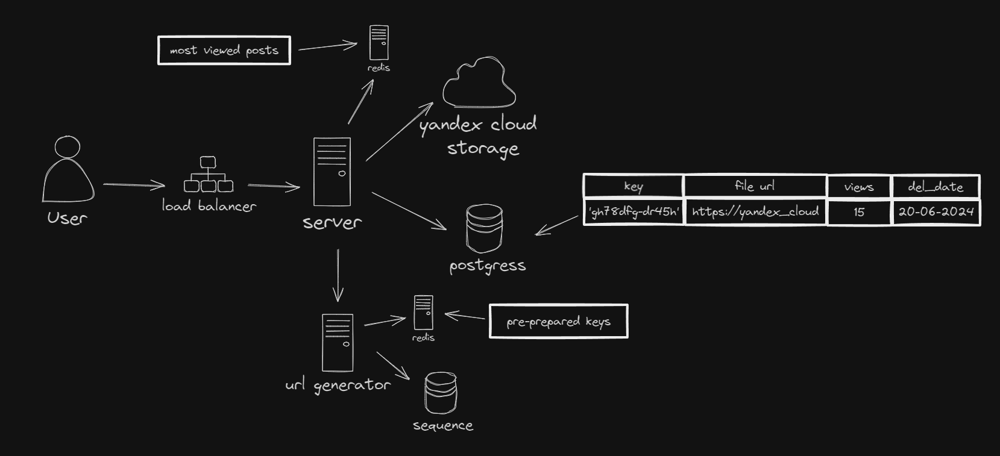

# Проект paste.py 
Клон pastebin предназначен для создания текстовых постов. 

А еще тут есть онлайн интерпретатор python кода

## Как работает

При создании поста делается запрос к генератору ссылок https://github.com/Neo-poznan/random-url-generator
Потом текст поста помещается в облачное хранилище а потом создается запись поста в базе данных
При получении доступа к посту по ссылке пост кэшируется в оперативной памяти на 30 минут. 
Если при запросе поста еще нет в кэше то сначала идем в базу данных, а потом в облачное хранилище чтобы получить там текст поста.
Удаление постов происходит автоматически линукс вызывает команду по которой удаляются посты, из базы данных достаются посты с сегодняшней датой удаления после чего они удаляются из облака и базы данных. 

Проект написан с использованием асинхронности а это значит что когда мы ждем ответа от генератора ключей или от облачного хранилища
сервер не простаивает а может обрабатывать другие запросы.

## Как запустить у себя
1. Создать директорию и поместить в нее репозиторий
2. Открыть в терминале и создать виртуалку `python3.12 -m venv env`
3. `source env/bin/activate`
4. Перейти в директорию которая является репозиторием проекта
5. `pip install -r requirements.txt`
6. `python3.12 manage.py makemigrations`
7. `python3.12 manage.py migrate`
8. Зайти в файл settings и добавить в свою операционную систему переменные окружения с соответствующими значениями 
9. `python3.12 manage.py runserver`
10. Развернуть генератор ссылок на порту 8001
11. Чтобы удалить устаревшие посты `python3.12 manage.py del_outdated_posts`
12. Чтобы кэшировать наиболее просматриваемые посты `python3.12 manage.py cache_most_viewed_posts`
