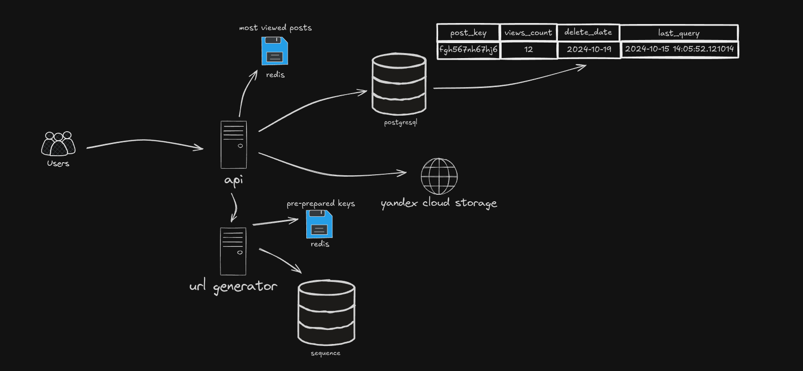

# Проект paste.py 
Клон pastebin предназначен для создания текстовых постов. 

А еще тут есть онлайн интерпретатор python кода

## Как работает

При создании поста делается запрос к генератору ссылок https://github.com/Neo-poznan/random-url-generator
Потом текст поста помещается в облачное хранилище а потом создается запись поста в базе данных
При получении доступа к посту по ссылке пост кэшируется в оперативной памяти на 30 минут. 
Если при запросе поста еще нет в кэше то сначала идем в базу данных, а потом в облачное хранилище чтобы получить там текст поста.
Удаление постов происходит автоматически линукс вызывает команду по которой удаляются посты, из базы данных достаются посты с сегодняшней датой удаления после чего они удаляются из облака и базы данных. 

Проект написан с использованием асинхронности а это значит что когда мы ждем ответа от генератора ключей или от облачного хранилища
сервер не простаивает а может обрабатывать другие запросы.

## Как запустить у себя
1. Создать директорию и поместить в нее репозиторий
2. Открыть в терминале и создать виртуалку `python3.12 -m venv env`
3. `source env/bin/activate`
4. Перейти в директорию которая является репозиторием проекта
5. `pip install -r requirements.txt`
6. `python3.12 manage.py makemigrations`
7. `python3.12 manage.py migrate`
8. Зайти в файл settings и добавить в свою операционную систему переменные окружения с соответствующими значениями 
9. `python3.12 manage.py runserver`
10. Развернуть генератор ссылок на порту 8001
11. Чтобы удалить устаревшие посты `python3.12 manage.py del_outdated_posts`
12. Чтобы кэшировать наиболее просматриваемые посты `python3.12 manage.py cache_most_viewed_posts`

# Тесты: 
#### Если есть ссылки в redis:
Request 0:  0.271
Request 1:  0.2435
Request 2:  0.3276
Request 3:  0.264
Request 4:  0.2521
Request 5:  0.3799
Request 6:  0.2602
Request 7:  0.2699
Request 8:  0.2656
Request 9:  0.308
Request 10:  0.2719
Request 11:  0.28
Request 12:  0.2719
Request 13:  0.3799
Request 14:  0.2721
Request 15:  0.3079
Request 16:  0.2561
Request 17:  0.2878
Request 18:  0.3278
Request 19:  0.2681
Request 20:  0.2838
Request 21:  0.2514
Request 22:  0.2966
Request 23:  0.256
Request 24:  0.2559
Request 25:  0.2719
Request 26:  0.3759
Request 27:  0.3239
Request 28:  0.2559
Request 29:  0.244
Request 30:  0.2841
Request 31:  0.3359
Request 32:  0.2959
Request 33:  0.26
Request 34:  0.2679
Request 35:  0.308
Request 36:  0.272
Request 37:  0.332
Request 38:  0.2758
Request 39:  0.3721
Request 40:  0.3518
Request 41:  0.264
Request 42:  0.3519
Request 43:  0.2632
Request 44:  0.4008
Request 45:  0.268
Request 46:  0.2599
Request 47:  0.268
Request 48:  0.3079
Request 49:  0.2519
Request 50:  0.264
Request 51:  0.2719
Request 52:  0.3361
Request 53:  0.3239
Request 54:  0.284
Request 55:  0.3799
Request 56:  0.324
Request 57:  0.34
Request 58:  0.264
Request 59:  0.2679
Request 60:  0.336
Request 61:  0.3599
Request 62:  0.26
Request 63:  0.308
Request 64:  0.2719
Request 65:  0.3679
Request 66:  0.2879
Request 67:  0.276
Request 68:  0.2959
Request 69:  0.304
Request 70:  0.3159
Request 71:  0.2905
Request 72:  0.2573
Request 73:  0.2841
Request 74:  0.3118
Request 75:  0.26
Request 76:  0.2879
Request 77:  0.264
Request 78:  0.3159
Request 79:  0.2679
Request 80:  0.2879
Request 81:  0.292
Request 82:  0.3279
Request 83:  0.3559
Request 84:  0.2801
Request 85:  0.3079
Request 86:  0.268
Request 87:  0.3
Request 88:  0.2799
Request 89:  0.332
common:  26.6262
#### Если всегда генерировать:
Request 0:  0.2829
Request 1:  1.3931
Request 2:  0.2798
Request 3:  0.2839
Request 4:  0.292
Request 5:  0.284
Request 6:  0.3038
Request 7:  0.308
Request 8:  0.2759
Request 9:  0.2879
Request 10:  0.3399
Request 11:  0.3355
Request 12:  0.3565
Request 13:  0.264
Request 14:  0.3398
Request 15:  0.256
Request 16:  0.276
Request 17:  0.344
Request 18:  0.3439
Request 19:  0.316
Request 20:  0.2959
Request 21:  0.2639
Request 22:  0.2719
Request 23:  0.3239
Request 24:  0.2679
Request 25:  0.3239
Request 26:  0.268
Request 27:  0.312
Request 28:  0.2719
Request 29:  0.2759
Request 30:  0.2999
Request 31:  0.2801
Request 32:  0.3279
Request 33:  0.2719
Request 34:  0.2394
Request 35:  0.2886
Request 36:  0.3322
Request 37:  0.3182
Request 38:  0.3478
Request 39:  0.2495
Request 40:  0.3756
Request 41:  0.2965
Request 42:  0.2837
Request 43:  0.284
Request 44:  0.2826
Request 45:  0.3615
Request 46:  0.2749
Request 47:  0.2888
Request 48:  0.316
Request 49:  0.332
Request 50:  0.2639
Request 51:  0.3159
Request 52:  0.316
Request 53:  0.296
Request 54:  0.2681
Request 55:  0.3197
Request 56:  0.2639
Request 57:  0.292
Request 58:  0.328
Request 59:  0.264
Request 60:  0.3159
Request 61:  0.3278
Request 62:  0.42
Request 63:  0.3039
Request 64:  0.256
Request 65:  0.2595
Request 66:  0.3283
Request 67:  0.3521
Request 68:  0.2759
Request 69:  0.2759
Request 70:  0.284
Request 71:  0.328
Request 72:  0.2759
Request 73:  0.2679
Request 74:  0.2785
Request 75:  0.3215
Request 76:  0.2639
Request 77:  0.292
Request 78:  0.2718
Request 79:  0.4041
Request 80:  0.2839
Request 81:  0.264
Request 82:  0.2758
Request 83:  0.2401
Request 84:  0.348
Request 85:  0.3039
Request 86:  0.2919
Request 87:  0.28
Request 88:  0.3078
Request 89:  0.2921
common:  28.0496